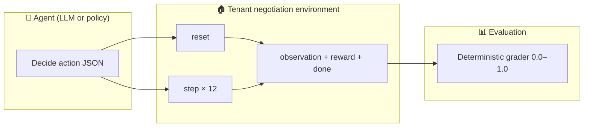
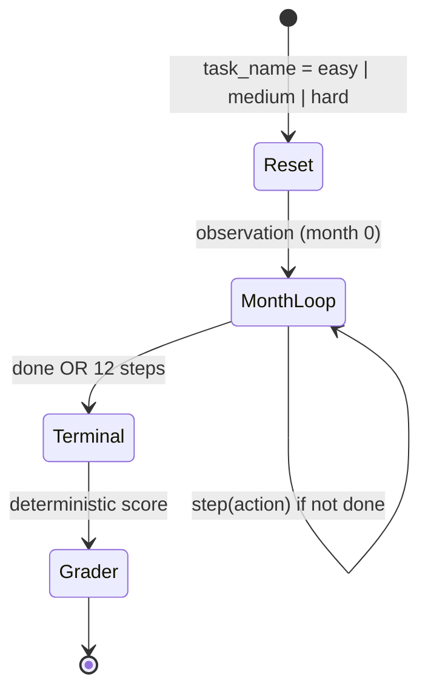

<div align="center">

# Negotiation-Aware Tenant AI Environment

**An [OpenEnv](https://github.com/meta-pytorch/OpenEnv)-compliant benchmark for multi-step property management under uncertainty.**

[](https://github.com/meta-pytorch/OpenEnv)
[](https://www.python.org/)
[](https://www.docker.com/)
[](https://huggingface.co/spaces/nikhilreddy3446/tenant-negotiator-env)
[](https://github.com/Nikhi-l37/Negotiation-Aware-Tenant-AI-Environment)

*Submission track: **Meta PyTorch OpenEnv Hackathon × Scaler School of Technology** (Round 1)*

[Overview](#overview) · [Why this matters](#why-this-matters-for-agent-evaluation) · [Specification](#environment-specification-3d-view) · [Tasks](#tasks--deterministic-graders) · [Quickstart](#quickstart) · [Submission checklist](#meta-hackathon-submission-checklist)

</div>

---

## Overview

This repository packages a **real-world-style decision environment**: an AI agent acts as a property manager for **12 monthly steps**, choosing how to adjust rent, offer discounts, perform maintenance, and negotiate. Success requires **balancing immediate cash flow with long-term tenant trust**, while reacting to **deterministic market shocks** communicated through observations.

The server exposes the standard OpenEnv pattern (`reset` → repeated `step` → terminal `done`), with typed **Action**, **Observation**, and **State** models and a manifest in `openenv.yaml`.



---

## Why this matters for agent evaluation

| Capability tested | How this environment encodes it |
|-------------------|----------------------------------|
| **Long-horizon planning** | 12-step episodes; early greed can trigger late failure |
| **Constraint reasoning** | Price-sensitive tenants leave if rent exceeds **110%** of `market_rate` |
| **Reading structured state** | Critical cues appear in `message`; static policies underperform |
| **Trade-offs under stress** | Profit vs. trust vs. mandatory maintenance (demanding tenants) |
| **Reproducibility** | Shocks occur on **fixed months** (3, 7, 10); graders are **non–LLM-judge** |

---

## Environment specification (“3D” view)

Think of the environment as three orthogonal layers that stack into one benchmark:

```text
                    ┌──────────────────────────────────────┐
                   ╱│  LAYER 3 — EVALUATION                │╲
                  ╱ │  Tasks: easy / medium / hard          │ ╲
                 ╱  │  Graders: tasks.py → [0, 1] scores    │  ╲
                ╱   └──────────────────────────────────────┘   ╲
               ╱┌──────────────────────────────────────┐         ╲
              ╱ │  LAYER 2 — DYNAMICS                   │        ╲
             ╱  │  Trust, rent, costs, vacancy, events  │         ╲
            ╱   └──────────────────────────────────────┘          ╲
           ╱    ┌──────────────────────────────────────┐           ╲
          ╱     │  LAYER 1 — OPENENV INTERFACE          │            ╲
         ╱      │  HTTP/WS server · typed models · client │             ╲
        ╱       └──────────────────────────────────────┘              ╲
       ╱______________________________________________________________╲
```

### Layer 1 — Interface (OpenEnv)

| Artifact | Role |
|----------|------|
| `openenv.yaml` | Environment name, entrypoint, client, task registry |
| `server/environment.py` | Core `reset` / `step` / `state` logic |
| `server/app.py` | FastAPI app via `create_app` |
| `client.py` | `TenantEnv` client for agents and baselines |
| `models.py` | Pydantic **TenantAction**, **TenantObservation**, **TenantState** |

### Layer 2 — Dynamics (economics + trust)

**Per-step reward (high level):** `rent − costs`, with a large **vacancy penalty** if the tenant leaves.

**Actions** (boolean flags; combinable):

| Action | Economic effect | Trust signal |
|--------|-----------------|--------------|
| `increase_rent` | Rent × 1.10 | Substantial negative delta |
| `offer_discount` | Cost = 5% of rent | Strong positive delta |
| `perform_maintenance` | Fixed $100 cost | Positive delta |
| `negotiate` | Rent × 1.02 | Small positive delta |

**Observations** include `rent`, `trust_score`, `tenant_type`, `months_stayed`, `is_vacant`, `market_rate`, `maintenance_due`, and `message`.

### Layer 3 — Evaluation (tasks + graders)

Three tasks map to distinct **tenant archetypes** and **grader formulas** in `tasks.py`. Scores are always in **[0.0, 1.0]** and reward **partial progress** (e.g., survival months on harder settings).

---

## Episode lifecycle (animated flow)

Each episode is a fixed horizon with clear termination:



**Deterministic market events** (same calendar every run; details in `message`):

| Month | Event | What changes |
|------:|--------|----------------|
| **3** | Pipe burst | Severe trust hit if maintenance is skipped |
| **7** | Market boom | `market_rate` increases (pricing ceiling shifts) |
| **10** | Job loss | Raising rent this month can collapse trust |

---

## Tasks & deterministic graders

| Task | Tenant profile | Core challenge |
|------|----------------|----------------|
| **easy** | Loyal (trust swings damped) | Grow rent while surviving shocks |
| **medium** | Price-sensitive | Stay under **110% × market_rate** after the boom |
| **hard** | Demanding | Maintenance every **3** months; miss → trust cliff |

Graders use episode totals and final state; see docstrings in `tasks.py` for baseline/ceiling logic.

---

## Quickstart

### Prerequisites

```bash
pip install -r requirements.txt
# Validator CLI (for local checks)
pip install openenv-core
```

### Run the server locally

```bash
uvicorn server.app:app --host 0.0.0.0 --port 8000
```

### Minimal client smoke test

```bash
python -c "
from client import TenantEnv
from models import TenantAction
with TenantEnv(base_url='http://localhost:8000').sync() as env:
    r = env.reset(task_name='easy')
    print(r.observation)
    r = env.step(TenantAction(negotiate=True))
    print(r.observation)
"
```

### Docker

```bash
docker build -t tenant-negotiation-env .
docker run -p 8000:8000 tenant-negotiation-env
```

### Baseline inference (`inference.py`)

The baseline agent uses the **OpenAI Python client** and prints structured logs:

`[START] …` → one `[STEP] …` per environment step → `[END] …` (required by the hackathon evaluator).

| Variable | Required | Purpose |
|----------|----------|---------|
| `API_BASE_URL` | Has default | LLM API base URL |
| `MODEL_NAME` | Has default | Model id |
| `HF_TOKEN` | **Yes** (for real LLM runs) | API key for the client |
| `LOCAL_IMAGE_NAME` | Optional | Docker image name when using local container mode |
| `ENV_BASE_URL` / `SPACE_URL` / `PING_URL` | Optional | URL of the running environment (e.g. Hugging Face Space) |
| `USE_LOCAL_DOCKER` | Optional (`0`/`1`) | Set to `1` only if you intentionally spawn the env via Docker from the script |

```bash
export API_BASE_URL="https://api.openai.com/v1"
export MODEL_NAME="gpt-4o"
export HF_TOKEN="your_token_here"
# If hitting a deployed Space instead of localhost:
# export ENV_BASE_URL="https://your-space.hf.space"

python inference.py
```

### Validate OpenEnv metadata

```bash
openenv validate
```

---

## Repository layout

```text
.
├── openenv.yaml           # OpenEnv manifest (name, tasks, entrypoints)
├── models.py              # Typed Action / Observation / State
├── client.py              # TenantEnv client
├── server/
│   ├── environment.py     # Core simulation + rewards
│   └── app.py             # FastAPI + create_app
├── tasks.py               # Task graders (0.0–1.0)
├── inference.py           # Hackathon baseline (structured stdout)
├── Dockerfile             # Container for HF Spaces / local parity
├── requirements.txt       # Locked Python dependencies
├── test_smoke.py          # Quick mechanical smoke run
└── README.md              # This document
```

---

## Baseline score expectations (illustrative)

Exact numbers depend on the **LLM** and **endpoint**. Strong models that read `message` and respect constraints typically score higher on **easy**, with **hard** remaining the tightest.

| Task | Typical band | Intuition |
|------|----------------|-----------|
| easy | ~0.4 – 0.8 | Forgiving tenant; shocks still punish blind policies |
| medium | ~0.3 – 0.7 | Market boom moves the tolerance line |
| hard | ~0.2 – 0.5 | Maintenance cadence + events compound difficulty |

---

## Meta hackathon submission checklist

Use this as a final gate before upload:

- [ ] **Hugging Face Space** builds, stays reachable, and `POST /reset` returns **200**
- [ ] `docker build` succeeds from the submitted `Dockerfile`
- [ ] `openenv validate` passes on the repo root
- [ ] `inference.py` runs to completion and emits **`[START]` / `[STEP]` / `[END]`** in the required format
- [ ] At least **three** tasks with graders are declared in `openenv.yaml` and return scores in **[0, 1]**

---

## Optional: add a looping demo (GIF)

GitHub does not animate Markdown itself, but you can drop a short screen recording into your repo or a release asset and embed it for a polished “live” feel:

```html
<!-- Replace with your own hosted GIF or MP4 thumbnail -->
<p align="center">
  
</p>
```

Create a `docs/` folder, add `demo.gif`, and the README will show an **animated** walkthrough on GitHub.

---

## License & attribution

Built with **[openenv-core](https://github.com/meta-pytorch/OpenEnv)** for the **Meta PyTorch OpenEnv Hackathon** ecosystem.  
If you reuse this environment in papers or benchmarks, please cite this repository and the OpenEnv project.

---

<div align="center">

**Questions?** Open an issue on GitHub or refer to the official hackathon help channel from your dashboard.

<sub>README crafted for clarity under competition review: interface, mechanics, and evaluation are intentionally separated.</sub>

</div>
